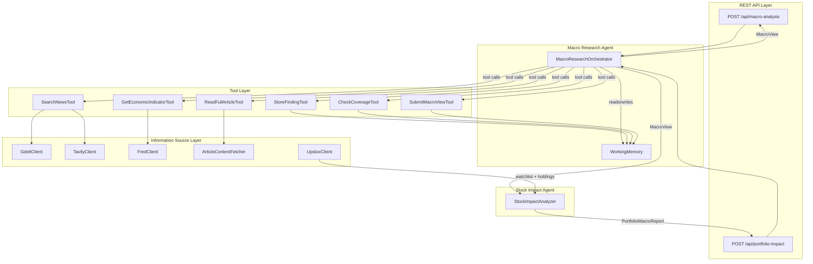
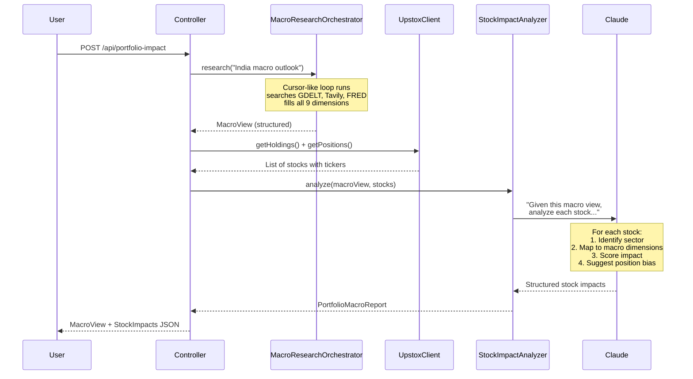

# Macroeconomic Research Agent -- Implementation Plan

## Current State

The existing app is a **plain Java CLI** (not Spring Boot) with:

- `SentimentAgentService.main()` as entry point
- `AppConfig` loading `application.properties` manually
- LangChain4j `@Agent` + `@Tool` annotations with Ollama/Mistral 7B
- 4 tools: `searchGdeltNews`, `getCollectedArticlesSummary`, `scoreSentiment`, `submitFinalReport`
- `SentimentResult` record with `analysis`, `score`, `confidence`
- GDELT as sole data source
- RAG via `NewsRagService` with in-memory embedding store

## Target State

A **Spring Boot 3.x** REST application with:

- Anthropic Claude as reasoning LLM
- Cursor-like ReAct loop (explicit, relentless, auto-reflective)
- 6 tools across 3 data sources (GDELT, Tavily, FRED)
- 9 macro dimensions with structured per-dimension output
- Working memory tracking findings per dimension
- Upstox broker integration for watchlist/holdings
- Stock Impact Agent that maps macro view to individual stocks with actionable position bias
- Two endpoints: `POST /api/macro-analysis` and `POST /api/portfolio-impact`

## Architecture

### Full System Flow




### Portfolio Impact Flow (the key differentiator)




## What Stays, What Changes, What's New

### Kept as-is

- `GdeltClient.java` -- GDELT HTTP + parsing (solid, tested)
- `GdeltArticle.java` -- article model with URL-based dedup
- `ArticleContentFetcher.java` -- HTML-to-text extraction
- `GdeltFetcherStep.java` -- fetch-and-merge dedup logic
- `NewsRagService.java` -- RAG embedding store (optional enrichment)
- `data/embedding-store/` -- persisted embeddings

### Modified

- `**pom.xml**` -- Add Spring Boot 3.x parent, `langchain4j-anthropic`, `spring-boot-starter-web`, HTTP clients for Tavily/FRED, remove `exec-maven-plugin` and manual jar config
- `**AppConfig.java**` -- Convert to Spring `@ConfigurationProperties` with nested config groups (anthropic, gdelt, tavily, fred, agent)
- `**application.properties**` -- Add Anthropic, Tavily, FRED config keys; keep GDELT keys
- `**SentimentAgentService.java**` -- Convert to `@SpringBootApplication` main class (thin launcher)

### Removed / Replaced

- `SentimentResearchAgent.java` (LangChain4j `@Agent` interface) -- replaced by explicit `MacroResearchOrchestrator`
- `SentimentResult.java` -- replaced by `MacroView` + `DimensionAssessment`
- `GdeltSentimentTools.java` -- split into 6 focused tool classes
- `SentimentScorerAgent.java`, `ResilientSentimentScorerAgent.java`, `MacroeconomicSentimentScorerAgent.java` -- scoring now happens inside the orchestrator's synthesis step
- `SentimentAgentLoop.java` -- replaced by `MacroResearchOrchestrator`

### New Files

**Models** (package `com.gdelt.sentiment.model`):

- `MacroDimension.java` -- enum: GROWTH, LABOR, INFLATION, MONETARY, FISCAL, EXTERNAL_TRADE, FINANCIAL_CONDITIONS, BUSINESS_CYCLE, COMMODITIES
- `Finding.java` -- record: dimension, signal, evidence, sources
- `DimensionAssessment.java` -- record: dimension, signal, score, summary, sources, lookDirection
- `MacroView.java` -- record: topic, dimensions list, overallSentiment, overallAnalysis, keyRisks, contradictions, timestamp
- `MacroAnalysisRequest.java` -- record: topic, optional dimensions filter
- `CoverageReport.java` -- record: covered dimensions, gaps, contradiction flags
- `StockInfo.java` -- record: tradingSymbol, name, isin, instrumentKey, exchange, quantity, averagePrice (from Upstox)
- `StockImpact.java` -- record: tradingSymbol, name, sector, impactDirection (POSITIVE/NEGATIVE/NEUTRAL), impactScore (-1.0 to 1.0), positionBias (OVERWEIGHT/UNDERWEIGHT/NEUTRAL/AVOID), biasConfidence (0.0 to 1.0), reasoning, affectedDimensions (list of MacroDimension with per-dimension impact explanation)
- `PortfolioMacroReport.java` -- record: macroView, stockImpacts list, portfolioOverallBias, sectorBreakdown, timestamp
- `PortfolioImpactRequest.java` -- record: topic, optional accessToken override

**Tools** (package `com.gdelt.sentiment.tool`):

- `SearchNewsTool.java` -- routes to GDELT or Tavily; preprocesses GDELT queries (strips analytical language, truncates to keywords); hybrid empty-result handling (auto-fallback to Tavily on first empty GDELT, agent-decides thereafter)
- `GetEconomicIndicatorTool.java` -- calls FRED API for hard macro data (GDP, CPI, rates, etc.)
- `ReadFullArticleTool.java` -- wraps existing `ArticleContentFetcher`
- `StoreFindingTool.java` -- writes to `WorkingMemory`
- `CheckCoverageTool.java` -- reads `WorkingMemory`, returns gap analysis
- `SubmitMacroViewTool.java` -- validates and builds final `MacroView` from working memory
- `ToolRouter.java` -- dispatches `ToolExecutionRequest` to the correct tool class, returns JSON result
- `GdeltQueryPreprocessor.java` -- strips analytical/sentiment words, truncates to 4-5 keywords, suggests alternatives for empty results
- `RateLimitedExecutor.java` -- wraps cached thread pool with per-source token bucket rate limiters (GDELT 1/10s, Tavily 1/1s, FRED 2/1s); 429 retry with exponential backoff; rate-limit status feedback to agent

**Agent Core** (package `com.gdelt.sentiment.agent`):

- `MacroResearchOrchestrator.java` -- Cursor-like ReAct loop for macro research
- `WorkingMemory.java` -- per-dimension findings tracker with coverage snapshots
- `MacroResearchPrompt.java` -- macroeconomist system prompt
- `StockImpactAnalyzer.java` -- takes MacroView + stock list, uses Claude to produce per-stock actionable analysis (see Stock Impact Agent section below)
- `StockImpactPrompt.java` -- equity analyst system prompt for stock-macro mapping

**Data Source Clients** (package `com.gdelt.sentiment.client`):

- `TavilyClient.java` -- HTTP client for Tavily Search API (`POST https://api.tavily.com/search`)
- `FredClient.java` -- HTTP client for FRED API (`GET https://api.stlouisfed.org/fred/series/observations`)
- `UpstoxClient.java` -- HTTP client for Upstox API v2 (holdings, positions, market quotes)

**Spring Boot** (package `com.gdelt.sentiment`):

- `MacroAnalysisController.java` -- `@RestController` with `POST /api/macro-analysis` and `POST /api/portfolio-impact`
- `LlmConfig.java` -- `@Configuration` bean for `AnthropicChatModel`
- `ClientConfig.java` -- `@Configuration` beans for all data source clients
- `UpstoxConfig.java` -- `@ConfigurationProperties` for Upstox OAuth2 credentials and endpoints

## Key Design Decisions

### Cursor-Like ReAct Loop (not LangChain4j @Agent)

The orchestrator implements four behaviors that make it work like Cursor's agent search loop:

1. **Safety cap, not research budget** -- `safetyLimit = 50` prevents infinite loops but never cuts research short. The agent decides when it's done, not an iteration counter.
2. **Explicit termination only** -- The loop ONLY exits when the agent calls `submitMacroView`. If Claude stops calling tools without submitting, the orchestrator nudges it to continue or finalize.
3. **Auto-injected coverage state** -- Every 4 tool calls, the orchestrator injects a coverage snapshot into the conversation so the agent always sees its own blind spots. The agent doesn't have to remember to call `checkCoverage`.
4. **Parallel tool execution** -- When Claude requests multiple tool calls in one turn (e.g., search 3 dimensions simultaneously), the orchestrator executes them concurrently using a thread pool.

The core of `MacroResearchOrchestrator.research(topic)`:

```java
public MacroView research(String topic) {
    WorkingMemory memory = new WorkingMemory();
    List<ChatMessage> messages = new ArrayList<>();
    messages.add(SystemMessage.from(MacroResearchPrompt.build()));
    messages.add(UserMessage.from("Research: " + topic));

    int safetyLimit = 50;
    int toolCallsSinceReflection = 0;

    for (int i = 0; i < safetyLimit; i++) {

        // AUTO-INJECT: coverage state every few tool calls
        if (toolCallsSinceReflection >= 4) {
            String snapshot = memory.getCoverageSnapshot();
            messages.add(UserMessage.from(
                "[COVERAGE UPDATE]\n" + snapshot +
                "\nContinue researching uncovered dimensions, " +
                "or call submitMacroView if evidence is sufficient."));
            toolCallsSinceReflection = 0;
        }

        ChatResponse response = chatModel.chat(ChatRequest.builder()
            .messages(messages)
            .toolSpecifications(toolSpecs)
            .build());

        AiMessage ai = response.aiMessage();
        messages.add(ai);

        List<ToolExecutionRequest> toolCalls = ai.toolExecutionRequests();

        // EXPLICIT TERMINATION: only stop on submitMacroView
        if (toolCalls == null || toolCalls.isEmpty()) {
            if (memory.isFinalViewSubmitted()) {
                break;
            }
            // nudge: agent stopped without finishing
            messages.add(UserMessage.from(
                "You haven't submitted your macro view yet. " +
                "Review coverage and either search for more " +
                "evidence or call submitMacroView to finalize."));
            continue;
        }

        // PARALLEL EXECUTION: run all tool calls concurrently
        List<ToolExecutionResultMessage> results =
            executeInParallel(toolCalls, memory);
        messages.addAll(results);

        toolCallsSinceReflection += toolCalls.size();

        // TOKEN OPTIMIZATION: compact history if over budget
        compactIfNeeded(messages, memory);

        if (memory.isFinalViewSubmitted()) {
            break;
        }
    }

    return memory.buildMacroView(topic);
}
```

**Why this matters**: A basic ReAct loop with `maxIterations = 5` and "break on no tool calls" would stop prematurely -- the agent might research 2-3 dimensions and then stop because it hit the iteration limit or because it emitted a reasoning message without a tool call. The Cursor-like loop guarantees the agent keeps going until it has explicitly decided it has enough evidence across all relevant dimensions.

### Parallel Tool Execution: Cached Thread Pool (not sub-agents)

**Clarification**: Threads execute HTTP calls (GDELT, Tavily, FRED), NOT LLM calls. The LLM reasoning is always sequential -- one Claude conversation, one turn at a time. When Claude returns 3 tool calls in one turn, the 3 API calls run concurrently on the thread pool.

**Thread pool choice**: `Executors.newCachedThreadPool()` -- creates threads on demand, reuses idle ones, auto-shrinks. Fits the bursty pattern (2-5 concurrent HTTP calls per turn, each 200ms-2s). No fixed sizing decisions, no wasted threads, no blocking.

**Not sub-agents because**: Macroeconomic research requires coherence across dimensions. A tariff headline touches 6 dimensions simultaneously. If 3 sub-agents researched independently, they'd miss these cross-cutting themes and duplicate searches. Single-agent with parallel tool I/O gives the best of both: fast data fetching + coherent reasoning.

```java
private final ExecutorService toolExecutor = Executors.newCachedThreadPool();

private List<ToolExecutionResultMessage> executeInParallel(
        List<ToolExecutionRequest> toolCalls, WorkingMemory memory) {
    List<CompletableFuture<ToolExecutionResultMessage>> futures = toolCalls.stream()
        .map(req -> CompletableFuture.supplyAsync(
            () -> {
                String result = toolRouter.execute(req, memory);
                return ToolExecutionResultMessage.from(req, result);
            }, toolExecutor))
        .toList();

    return futures.stream()
        .map(CompletableFuture::join)
        .toList();
}
```

### Token Optimization Strategy

The ReAct loop sends the full conversation history to Claude on every iteration. Without optimization, a 25-iteration research session could accumulate 500K+ input tokens (~$1.50-$2.00 per analysis with Claude Sonnet). Three strategies keep this under control:

**Strategy 1: Tool result compression** -- The biggest token sink is raw search results. A GDELT search returning 25 articles with titles + snippets + URLs can be 2,000+ tokens. We compress tool results before storing them in the message history:

```java
private String compressToolResult(String toolName, String rawResult) {
    if ("searchNews".equals(toolName)) {
        // Parse 25 articles, extract: article count, top themes,
        // key source names, date range. ~200 tokens instead of ~2,000.
        return SearchResultCompressor.compress(rawResult);
    }
    if ("getEconomicIndicator".equals(toolName)) {
        // Keep most recent 3-4 data points + trend direction.
        return IndicatorCompressor.compress(rawResult);
    }
    return rawResult; // storeFinding, checkCoverage are already compact
}
```

The full raw results are still available to `storeFinding` (the tool sees them before compression). Only the message history version is compressed.

**Strategy 2: Sliding window with summarization** -- When total conversation tokens exceed a budget (default 25K), older tool results and reasoning are summarized into a condensed block:

```java
private static final int TOKEN_BUDGET = 25_000;

private void compactIfNeeded(List<ChatMessage> messages, WorkingMemory memory) {
    if (estimateTokenCount(messages) > TOKEN_BUDGET) {
        // Keep: system prompt + last 6 messages (recent context)
        // Summarize: everything in between → 500-token research summary
        // The coverage snapshot already captures structured findings
        String researchSoFar = summarizeOlderMessages(messages);
        messages.clear();
        messages.add(systemMessage);
        messages.add(UserMessage.from("[RESEARCH CONTEXT]\n" + researchSoFar));
        messages.add(UserMessage.from("[COVERAGE]\n" + memory.getCoverageSnapshot()));
        messages.addAll(recentMessages);
    }
}
```

**Strategy 3: Working memory IS the token optimizer** -- The `WorkingMemory` stores structured findings per dimension. Even if we truncate the conversation history, no information is lost -- it's all in the working memory. The auto-injected coverage snapshot effectively serves as a compressed representation of everything the agent has learned so far. This is why working memory is architecturally critical, not just a convenience.

**Estimated token budget per analysis:**

- Without optimization: ~500K-700K input tokens over full session
- With compression + sliding window: ~80K-120K input tokens
- Cost with Claude Sonnet: ~$0.25-$0.35 per macro analysis

### GDELT Keyword Resilience (4-layer defense)

GDELT's Doc API is pure keyword matching, not semantic search. Claude naturally generates natural-language queries that GDELT can't match. Without mitigation, the agent would get empty results and wrongly conclude there's no coverage.

**Layer 1 -- Prompt instructions**: The system prompt explicitly tells Claude how GDELT works:

```
GDELT is keyword-based, NOT semantic search.
- Use short, specific keyword phrases (2-4 words)
- BAD:  "hawkish Federal Reserve stance on rising inflation"
- GOOD: "Federal Reserve interest rate"
- Avoid adjectives, opinions, or analytical language in GDELT queries
- For natural language queries, use source=TAVILY instead
```

**Layer 2 -- Query preprocessing** (`GdeltQueryPreprocessor`): Before sending to GDELT, the tool strips analytical language and truncates:

```java
// "hawkish Federal Reserve stance on rising inflation" 
//   → strips: "hawkish", "stance", "rising"
//   → result: "Federal Reserve inflation"
```

**Layer 3 -- Hybrid empty-result handling**:

- First empty GDELT result per research session: **auto-fallback** to Tavily, return combined result with a note ("GDELT returned 0 results, auto-retried with Tavily")
- Subsequent empty GDELT results: **agent decides** -- tool returns suggestions ("try shorter keywords, or use TAVILY which supports natural language queries") and lets Claude choose

**Layer 4 -- Alternative keyword suggestions**: On empty results, the tool suggests concrete alternatives based on the original query. E.g., for "US economic growth outlook" it suggests: "GDP growth", "recession", "PMI manufacturing".

### Rate Limiting and Resilience

Three data sources with different rate limits, all accessed from a relentless agent loop that could fire dozens of requests. Without centralized rate limiting, the agent would hit 429s and produce incomplete analysis.

**Per-source rate limits:**

- GDELT: 1 request per 10 seconds (strictest -- existing `GdeltClient` already enforces this)
- Tavily: 1 request per 1 second (Basic plan: 1,000/month)
- FRED: 2 requests per 1 second (120/minute official limit)

`**RateLimitedExecutor`**: Wraps the cached thread pool with per-source token bucket rate limiters. Calls to **different** sources run concurrently. Calls to the **same** source are serialized by the limiter.

```java
// These 3 run in parallel (different sources):
searchNews("Fed rates", GDELT)     → GDELT limiter: passes
searchNews("US CPI", TAVILY)       → Tavily limiter: passes  
getEconomicIndicator("CPIAUCSL")   → FRED limiter: passes

// These 2 are serialized (same source):
searchNews("Fed rates", GDELT)     → GDELT limiter: passes (t=0)
searchNews("trade balance", GDELT) → GDELT limiter: waits 10s (t=10)
```

**429 retry with backoff**: Even with rate limiters, APIs can still 429 (shared limits, server-side throttling). Each tool call retries up to 3 times with exponential backoff (1s, 2s, 4s). After 3 failures, returns a structured error that the agent can reason about.

**Agent-aware degradation**: If a source is rate-limited, the tool result tells the agent:

```
"GDELT is rate-limited (retry in ~10s). Consider using TAVILY 
 for your next search to avoid delays."
```

This lets Claude adapt its research strategy rather than blindly retrying the same source.

### Tool Specifications

Each tool class exposes a `ToolSpecification` (name, description, parameters as JSON schema) that gets registered with Claude. Example for `searchNews`:

```java
ToolSpecification.builder()
    .name("searchNews")
    .description("Search for macroeconomic news articles. Use source=GDELT for raw news volume, source=TAVILY for broader web coverage including analysis pieces.")
    .parameters(JsonObjectSchema.builder()
        .addStringProperty("query", "Search query string")
        .addEnumProperty("source", "GDELT or TAVILY")
        .addIntegerProperty("maxResults", "Max articles to return (default 25)")
        .build())
    .build();
```

### Working Memory

`WorkingMemory` is a per-request object (not shared across requests):

- `Map<MacroDimension, List<Finding>>` for findings
- `Set<MacroDimension> coveredDimensions()` -- dimensions with >= 1 finding
- `Set<MacroDimension> gaps()` -- dimensions with 0 findings
- `List<String> contradictions()` -- dimensions with conflicting signals
- `getCoverageSnapshot()` -- human-readable summary of what's covered and what's missing, auto-injected into the conversation by the orchestrator every few tool calls so the agent always sees its own blind spots
- `isFinalViewSubmitted()` -- returns true only after the agent calls `submitMacroView`
- `buildMacroView(topic)` -- assembles final structured output from all stored findings

### Tavily Integration

Tavily's API is simple -- one POST endpoint:

```
POST https://api.tavily.com/search
{
  "query": "Federal Reserve interest rate decision",
  "search_depth": "advanced",
  "max_results": 10,
  "include_answer": false
}
```

Returns `results[]` with `title`, `url`, `content` (snippet), `score`. We map these to the same shape as GDELT articles for the agent.

### FRED Integration

FRED API is free (requires API key):

```
GET https://api.stlouisfed.org/fred/series/observations
    ?series_id=CPIAUCSL&api_key=xxx&file_type=json&sort_order=desc&limit=12
```

Returns monthly/quarterly observations. We support key series: GDP (`GDPC1`), CPI (`CPIAUCSL`), unemployment (`UNRATE`), Fed funds rate (`FEDFUNDS`), trade balance (`BOPGSTB`), gold (`GOLDAMGBD228NLBM`), oil (`DCOILWTICO`), PMI, etc.

### Upstox Broker Integration

Upstox API v2 uses OAuth2 authentication. The flow:

1. **One-time setup**: User registers an app at Upstox Developer Console, gets `api_key` + `api_secret`
2. **Login flow**: User visits `https://api.upstox.com/v2/login/authorization/dialog?client_id={api_key}&redirect_uri={redirect}&response_type=code` in a browser
3. **Token exchange**: App receives auth `code`, exchanges it for `access_token` via `POST /v2/login/authorization/token`
4. **API calls**: All subsequent calls use `Authorization: Bearer {access_token}`

**Endpoints we use:**

- `GET /v2/portfolio/long-term-holdings` -- stocks held in DEMAT (the "watchlist" for long-term analysis)
- `GET /v2/portfolio/positions` -- intraday positions (optional, for active traders)
- `GET /v2/market-quote/quotes?instrument_key=NSE_EQ|{isin}` -- current market price for each stock

**Instrument key format**: `NSE_EQ|INE002A01018` (exchange_segment pipe ISIN)

**Important limitation**: Upstox does NOT provide sector/industry classification for stocks. The instrument data only includes `name`, `trading_symbol`, `isin`, `exchange`, `segment`. Sector mapping is handled by Claude in the Stock Impact Agent (see below).

**Configuration** (`application.properties`):

```properties
upstox.apiKey=your_api_key
upstox.apiSecret=your_api_secret
upstox.redirectUri=http://localhost:8080/api/upstox/callback
upstox.accessToken=  # set after OAuth login, or via env var
```

### Stock Impact Agent -- The Core Differentiator

This is the component that maps macro analysis to your actual portfolio. It's a **separate Claude call** (not part of the ReAct loop) that takes the structured `MacroView` and your stock list as input.

**Why a separate agent (not part of the macro research loop):**

- The macro research agent's job is purely research -- gathering evidence and forming a view
- Stock impact analysis is a different skill -- it requires equity analysis, sector knowledge, and understanding of how macro factors transmit to individual companies
- Separating them means you can re-run stock impact analysis on the same macro view with different watchlists (e.g., your portfolio vs. a sector ETF basket)

**How it works:**

```java
public List<StockImpact> analyze(MacroView macroView, List<StockInfo> stocks) {
    String prompt = StockImpactPrompt.build(macroView, stocks);

    // Single Claude call with structured output
    ChatResponse response = chatModel.chat(ChatRequest.builder()
        .messages(List.of(
            SystemMessage.from(StockImpactPrompt.SYSTEM),
            UserMessage.from(prompt)
        ))
        .build());

    return parseStockImpacts(response.aiMessage().text());
}
```

**The Stock Impact Prompt** instructs Claude to act as an equity analyst:

```
You are a senior equity analyst. Given a structured macroeconomic view
and a list of stocks from a portfolio, analyze how current macro
conditions affect each stock.

For EACH stock:
1. IDENTIFY the sector/industry (you know Indian listed companies)
2. MAP which macro dimensions are most relevant to this stock and why
3. SCORE the macro impact (-1.0 bearish to +1.0 bullish)
4. RECOMMEND a position bias: OVERWEIGHT, UNDERWEIGHT, NEUTRAL, or AVOID
5. EXPLAIN your reasoning in 2-3 sentences, citing specific macro findings

Consider these transmission channels:
- Interest rate sensitivity (banks, NBFCs, real estate)
- Commodity exposure (metals, oil & gas, FMCG input costs)
- Export/import dependency (IT services, pharma, auto components)
- Consumer demand sensitivity (FMCG, auto, discretionary)
- Government spending linkage (infra, defense, PSUs)
- Currency impact (IT exporters benefit from weak INR, importers suffer)
```

**Example output for a stock:**

```json
{
  "tradingSymbol": "HDFCBANK",
  "name": "HDFC Bank Ltd",
  "sector": "Banking - Private",
  "impactDirection": "NEGATIVE",
  "impactScore": -0.35,
  "positionBias": "UNDERWEIGHT",
  "biasConfidence": 0.72,
  "reasoning": "RBI's hawkish stance with rates at 6.5% compresses net interest margins. Sticky inflation (CPI 5.1%) delays rate cuts that would boost credit growth. However, strong employment data supports retail loan book quality, partially offsetting the rate headwind.",
  "affectedDimensions": [
    {
      "dimension": "MONETARY",
      "impact": "Hawkish RBI stance compresses NIMs, delays rate cut catalyst",
      "relevance": "HIGH"
    },
    {
      "dimension": "INFLATION",
      "impact": "Sticky inflation keeps rates higher for longer",
      "relevance": "HIGH"
    },
    {
      "dimension": "LABOR",
      "impact": "Strong employment supports retail loan quality",
      "relevance": "MEDIUM"
    }
  ]
}
```

**Sector mapping strategy**: Claude knows the sector of every major NSE/BSE listed company. Rather than maintaining a static sector database (which gets stale), we let Claude classify each stock's sector as part of its analysis. This works reliably for hundreds of stocks and requires zero maintenance.

## Implementation Order

Each step builds on the previous one and produces a testable increment.

**Step 1: Spring Boot migration + Anthropic LLM**

- Add Spring Boot 3.x parent + starters to `pom.xml`
- Add `langchain4j-anthropic` dependency
- Convert `AppConfig` to `@ConfigurationProperties`
- Create `LlmConfig` bean with `AnthropicChatModel`
- Convert `SentimentAgentService` to `@SpringBootApplication`
- Verify: app starts, Claude model bean loads

**Step 2: Structured models**

- Create `MacroDimension` enum, `Finding`, `DimensionAssessment`, `MacroView`, `CoverageReport`, `MacroAnalysisRequest` records
- These are pure data classes with no dependencies -- can be tested in isolation

**Step 3: Working memory + coverage checker**

- Create `WorkingMemory` with dimension map, coverage tracking, contradiction detection
- Create `StoreFindingTool`, `CheckCoverageTool`, `SubmitMacroViewTool`
- Unit test: store findings, check gaps, build macro view

**Step 4: Rate limiting + Tavily client**

- Create `RateLimitedExecutor` with per-source token bucket limiters (GDELT 1/10s, Tavily 1/1s, FRED 2/1s)
- Add 429 retry with exponential backoff (3 attempts, 1s/2s/4s)
- Add rate-limit status feedback for agent-aware degradation
- Create `TavilyClient` using `java.net.http.HttpClient` (routed through `RateLimitedExecutor`)
- Create `GdeltQueryPreprocessor` -- strips analytical language, truncates to keywords, generates alternative suggestions
- Create `SearchNewsTool` that:
  - Routes to GDELT or Tavily based on `source` param
  - Preprocesses GDELT queries via `GdeltQueryPreprocessor`
  - Hybrid empty-result handling: auto-fallback to Tavily on first empty GDELT, agent-decides thereafter
- Integration test: search Tavily, test GDELT empty→Tavily fallback, test rate limiter serialization

**Step 5: FRED client**

- Create `FredClient` using `java.net.http.HttpClient` (routed through `RateLimitedExecutor`)
- Create `GetEconomicIndicatorTool` with series mapping
- Integration test: fetch CPI data from FRED, test rate limiting

**Step 6: Cursor-like ReAct orchestrator + token optimization**

- Create `ToolRouter` to dispatch tool execution requests (via `RateLimitedExecutor`)
- Create `MacroResearchPrompt` with the macroeconomist methodology (includes GDELT keyword guidance)
- Create `MacroResearchOrchestrator` with the Cursor-like loop:
  - Safety cap (50), not research budget
  - Explicit termination only (on `submitMacroView`)
  - Auto-injected coverage snapshots every 4 tool calls
  - Nudging when agent stops without finalizing
  - Parallel tool execution via `Executors.newCachedThreadPool()` + `CompletableFuture` (rate-limited per source)
- Token optimization layer:
  - `SearchResultCompressor` -- compresses 25-article results to ~200 tokens
  - `IndicatorCompressor` -- keeps recent data points + trend
  - `compactIfNeeded()` -- sliding window summarization when history > 25K tokens
  - `estimateTokenCount()` -- approximation based on character count / 4
- Create `ReadFullArticleTool` (wraps existing `ArticleContentFetcher`)
- Integration test: full research cycle on "US macro outlook"

**Step 7: REST controller**

- Create `MacroAnalysisController` with `POST /api/macro-analysis`
- Wire orchestrator as Spring bean
- End-to-end test via HTTP

**Step 8: Polish and configuration**

- Error handling, timeouts, retry logic
- Logging of each agent step (tool call, result, reasoning)
- Configuration validation on startup
- Update `README.md` with setup instructions (API keys needed: Anthropic, Tavily, FRED)

